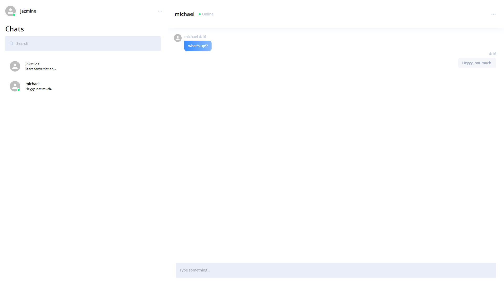
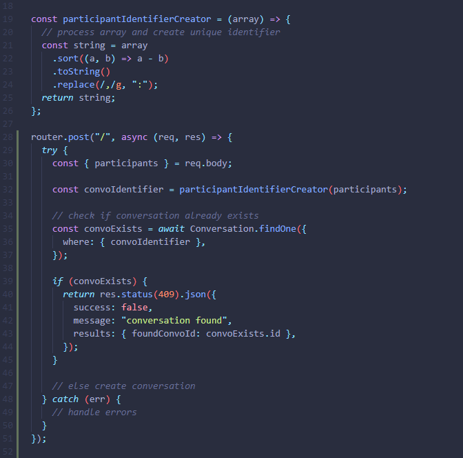

## Overview

The goal of this project was simple, create a messaging application that took advantage of WebSockets to provide real-time communication.

This project was used to test my ability to develop something small in a timely manner (under 2 weeks), with great attention to detail, while following proper agile development flow. Along the way, I picked up the basics of sockets, practiced some backend unit testing, and got to experience code reviews that provided me with invaluable advice that I could not get otherwise.

This project is not currently hosted anywhere. If you wish to see the app at work, you can either clone it from the provided repo or ask me for a demonstration.

## Challenges & Solutions

Although the app only supports 1 to 1 conversations, I wanted to make sure my database could eventually accommodate group conversations. As such, instead of the Conversations table containing any information about the participants that are involved in the conversation (e.g. sentBy, sentTo, or participantA, participantB), I created a User_Conversation junction table that contains entries that point a user to a conversation.

Eventually, I realized I introduced a new problem. How do I make sure a conversation between two users doesn’t already exist? As of now, if I search for a user, and click on their name, I would create a brand-new conversation without checking if one already exists. I could handle this in quite a few ways. 

<ol class="list-outside card section">
<li>I could find all the user’s (the current user making the api call) conversations and check if the other person exists in a conversation, and also make sure nobody else does (i.e. void if it’s a group conversation).</li>
<li>I could search the User_Conversation junction table to find all entries that contain the current user and other user as userIds, and see if they share a conversation while also making sure it’s not a group conversation.</li>
<li>I could make some sort of identifier column with a value that referred to the participants of that conversation.</li>
</ol>

As options 1 and 2 required making multiple calls to the database, and or excessive filtering of the data retrieved, I went with option 3 as it was by far the simplest and most efficient way. I got the idea from this <a href="https://stackoverflow.com/questions/49090027/retrieving-chat-history-between-two-users-sequelize">stackoverflow post</a>. I basically setup a helper function that would concatenate the ids of all the participants separated by a colon. I made sure to sort the ID’s in ascending order to ensure that the string would always be the same when given the same array of ID’s, regardless of order.

Example: [323, 112, 2000] => “112:323:2000”

This made searching for a conversation between 2 or more users efficient and easier to manage.

## Design

The design was actually developed by another team of individuals, so my job was simply to replicate their mockups. 

## Takeaways

- I definitely prefer to prioritize backend development prior to frontend. Otherwise I find myself rehauling the frontend.
