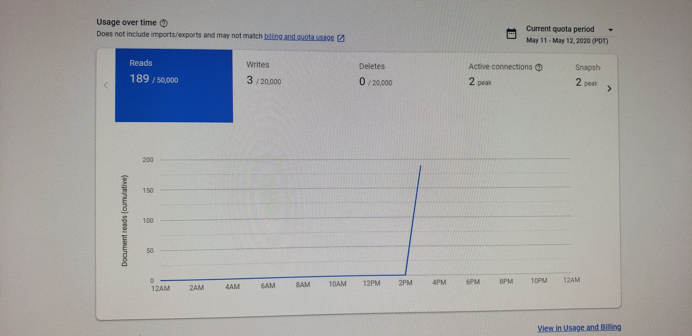
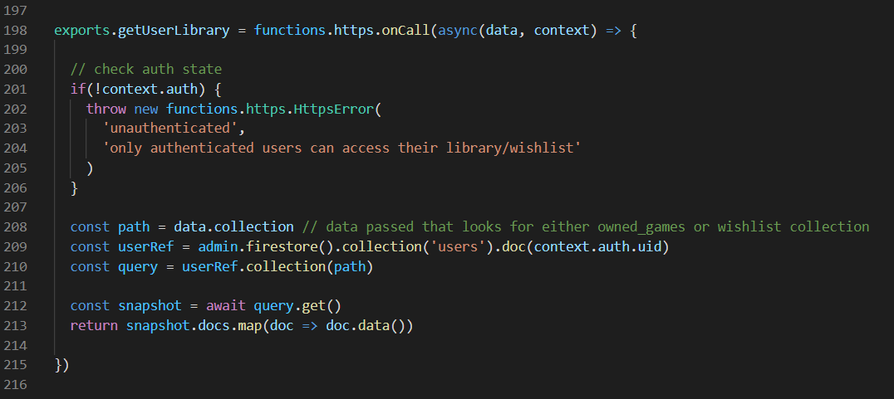

NOTE: Due to heroku's removal of their free tier, this project is currently not being hosted anywhere. I hope to find some time to reupload this project somewhere else soon!

## Overview

This app is an ongoing passion project of mine. As an avid video game collector, I wanted a way to catalogue my physical collection digitally as I often forget what I’ve purchased/already own, resulting in me buying two copies of the same game. Although websites like this already exist, I find them ocerflowing with advertising, or rocking a rather outdated design.

On a more technical level, I really wanted to push myself into building something that was truly my own, with technology that wasn’t the result of blindly following a tutorial with minor tweaks to personalize it.

## Challenges & Solutions

As with any project there were many hurdles, both small and large, that I encountered. CORS, setting up proxies, state management, all presented difficulties in one way or another, however they were definitely not the worst. I think the most challenging thing was figuring out how to keep state up to date with real time data without making excessive requests to firebase or IGDB (well not anymore since moving to Twitch) as both of them keep track and eventually charge after too many requests.

About midway through the project, I realized firebase was receiving dozens of reads and writes upon each page refresh. As a user’s wishlist or collection became bigger, this usage would increase exponentially, something that really worried me if I wanted to keep the app free. 

After adding a few guard clauses, refactoring the database to accept some minor repetition (something I always thought was bad), and getting rid of unnecessary calls for a database snapshot after every user event, I managed to significantly reduce firebase’s usage and develop much neater and concise functions.

## Design

The design was meant to be relatively simple with tiles representing each game and some basic animations for the buttons that provide functionality. Currently there is a search page, user profile page, and account settings page. I intend to eventually develop a friend feature as well as some modals so that users can edit which system(s) they own a specific game on as well as notes.

## Takeaways

- Vuex helped me understand many of the concepts I failed to grasp when learning Redux.
- Firebase is a great tool, however it has its own weaknesses/limitations that need to be considered.
- Apparently having firebase’s usage screen open counts towards the reads &#128579;.
- It's okay to keep state up to date from the frontend in order to reduce database queries.
- Guard clauses can simplify many functions.
