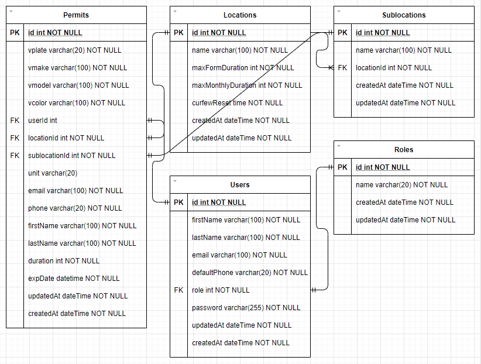

## Overview

The client, <a href="https://skyviewsecurity.ca/" target="_blank">Skyview Security</a> is a Canadian owned private security company that operates within Toronto and services the GTA as well as its surrounding regions.

The client is growing rapidly and was looking for ways in which they may improve the way parking enforcement was handled at one of their locations. Prior to this app, parking permit registrations were managed manually through SMS and email channels. Although effective, the ability to recieve, filter, and manage permits became stressful and time-consuming.

The initial version of the app (currently live) works perfectly fine, however, a newer version is in the works with some much-needed enhancements that should be implemented by the end of December pending approval. The overall technologies used are pretty much the same except for the addition of Sequelize as the ORM. Features such as resident/visitor login is being added, as well as some UI/UX enhancements.

## Challenges

The challenge was to construct a simple, yet powerful application that would be easy for both employees and residents/visitors to use; all within a few weeks with careful consideration of budget.

## Solutions

Developing an application with a fully functioning backend (server), properly structured database, and a professional looking interface within a short time period required me to make many quick and well-thought out decisions as to what technologies I would use. I had decided early on that I would be using Digital Ocean to host the application and the MERN (M being MySQL) stack to build it. Prior to any coding, I mapped out the initial intended database with the use of ER (Entity-Relationship) diagram software.

For authentication, I leveraged the JWT library as the frontend was client-rendered and it was nice and simple to implement. Since there was little time, budget, or need to focus on a custom design, Material UI came in clutch to power the majority of the interface.

In order to keep costs low, we had the application accessible via a subdomain of the main site, which at the time was hosted on GoDaddy, and required some basic DNS configuration to point the subdomain to Digital Ocean. 

As of today the application is used daily and accomplishes its intended purpose with the capability for expansion possible.

## Design

The overall design is powered by Material UI with minor customizations made throughout.

## Takeaways

Many of the aforementioned technologies were new to me and so I needed to learn to use them quickly and effectively. Some of the more challenging and most rewarding things to learn included Redux, MySQL, SSHing into Digital Ocean and working with Linux via a terminal, and Sequelize. Overall, my confidence with backend development, as well as my ability to deploy an application has greatly improved thanks to this project.
